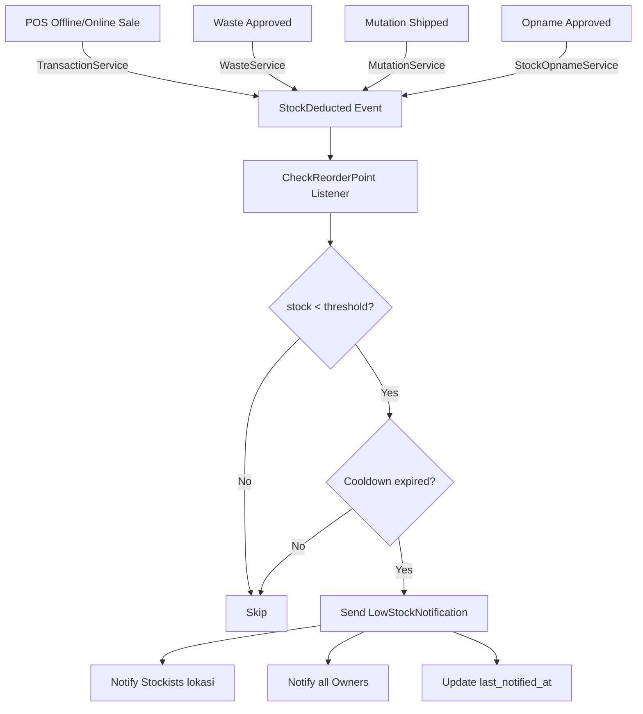

# Sprint 9 — Backend Summary: Reorder Point (S9-B01 s/d S9-B06)

**Tanggal:** 11 Mei 2026  
**Deliverable:** Backend Reorder Point lengkap — migrasi, model, repository, service, controller, event/listener, notifikasi.

---

## 1. Ringkasan Perubahan

### File Baru (8 file)

| File | Deskripsi |
|------|-----------|
| `database/migrations/2026_05_11_010000_create_reorder_points_table.php` | Migrasi tabel `reorder_points` dengan unique constraint per `product_id + location_id` |
| `app/Models/ReorderPoint.php` | Model Eloquent dengan relasi `product`, `location`, `creator`, `updater` + helper `isCooldownExpired()` |
| `app/Events/StockDeducted.php` | Event universal yang di-fire setiap kali stok berkurang di lokasi manapun |
| `app/Listeners/CheckReorderPoint.php` | Listener yang me-listen `StockDeducted` → cek threshold → kirim notifikasi |
| `app/Notifications/LowStockNotification.php` | Notifikasi database untuk alert stok rendah |
| `app/Repositories/Contracts/ReorderPointRepositoryInterface.php` | Interface repository |
| `app/Repositories/ReorderPointRepository.php` | Implementasi repository (CRUD + query low stock alerts) |
| `app/Services/ReorderPointService.php` | Service layer: `set`, `update`, `toggle`, `delete`, `checkThreshold`, `getLowStockAlerts` |
| `app/Http/Controllers/ReorderPointController.php` | Controller: `index`, `create`, `store`, `update`, `toggle`, `destroy`, `lowStockAlerts` |

### File Dimodifikasi (6 file)

| File | Perubahan |
|------|-----------|
| `app/Providers/AppServiceProvider.php` | +Binding `ReorderPointRepositoryInterface` |
| `app/Providers/EventServiceProvider.php` | +Mapping `StockDeducted → CheckReorderPoint` |
| `routes/web.php` | +7 route baru (Reorder Point CRUD + API low stock) |
| `app/Services/TransactionService.php` | +Fire `StockDeducted` setelah POS Offline & Online sale |
| `app/Services/WasteService.php` | +Fire `StockDeducted` setelah waste approve |
| `app/Services/MutationService.php` | +Fire `StockDeducted` setelah mutasi shipped |
| `app/Services/StockOpnameService.php` | +Fire `StockDeducted` setelah opname approved (item berkurang) |
| `app/Services/OfflineSyncService.php` | Fix `catch(\Exception)` → `catch(\Throwable)` (Sprint 7 bugfix) |

---

## 2. Skema Database

### Tabel: `reorder_points`

```sql
CREATE TABLE reorder_points (
    id              BIGINT UNSIGNED PRIMARY KEY AUTO_INCREMENT,
    product_id      BIGINT UNSIGNED NOT NULL,      -- FK → products
    location_id     BIGINT UNSIGNED NOT NULL,      -- FK → locations
    min_quantity    DECIMAL(12,2) NOT NULL,         -- Threshold dalam base_uom (FR-1209)
    is_active       BOOLEAN DEFAULT TRUE,           -- Toggle (FR-1215)
    last_notified_at TIMESTAMP NULL,                -- Cooldown tracker (FR-1214)
    created_by      BIGINT UNSIGNED NULL,           -- FK → users
    updated_by      BIGINT UNSIGNED NULL,           -- FK → users
    created_at      TIMESTAMP,
    updated_at      TIMESTAMP,

    UNIQUE KEY (product_id, location_id)            -- FR-1210
);
```

---

## 3. API Endpoints

### CRUD (Owner + Stockist)

| Method | URL | Name | Deskripsi |
|--------|-----|------|-----------|
| `GET` | `/inventory/reorder-points` | `reorder-points.index` | List reorder points (paginated, filter `location_id`) |
| `GET` | `/inventory/reorder-points/create` | `reorder-points.create` | Form set reorder point baru |
| `POST` | `/inventory/reorder-points` | `reorder-points.store` | Simpan/upsert reorder point |
| `PUT` | `/inventory/reorder-points/{id}` | `reorder-points.update` | Update min_quantity |
| `PATCH` | `/inventory/reorder-points/{id}/toggle` | `reorder-points.toggle` | Toggle aktif/nonaktif (FR-1215) |
| `DELETE` | `/inventory/reorder-points/{id}` | `reorder-points.destroy` | Hapus reorder point |

### Dashboard API (All Authenticated)

| Method | URL | Name | Deskripsi |
|--------|-----|------|-----------|
| `GET` | `/api/reorder-points/low-stock` | `reorder-points.low-stock` | JSON: current low stock alerts |

---

## 4. Event Flow: Real-time Threshold Check



---

## 5. FR Coverage Matrix

| FR | Requirement | Status | Implementasi |
|----|-------------|--------|--------------|
| FR-1207 | Stockist set min stok untuk TOKO-NYA | ✅ | `ReorderPointController@store` — Stockist hanya bisa set untuk `location_id` sendiri |
| FR-1208 | Owner set/override untuk TOKO MANAPUN | ✅ | `ReorderPointController@store` — Owner tidak dibatasi oleh `location_id` |
| FR-1209 | Threshold dalam base_uom | ✅ | Kolom `min_quantity` menggunakan `decimal(12,2)` dalam `base_uom` |
| FR-1210 | UNIQUE per product per location | ✅ | Unique DB constraint + upsert logic di `ReorderPointService@set` |
| FR-1211 | Cek REAL-TIME setiap stok berkurang | ✅ | `StockDeducted` event di-fire dari 4 trigger point → `CheckReorderPoint` listener |
| FR-1212 | Notif ke Stockist toko jika stok < min | ✅ | `LowStockNotification` → semua Stockist aktif di lokasi terkait |
| FR-1213 | Alert di dashboard Owner | ✅ | `LowStockNotification` → semua Owner aktif + API `/api/reorder-points/low-stock` |
| FR-1214 | Cooldown 1 jam per produk per toko | ✅ | `last_notified_at` + `isCooldownExpired()` helper di model |
| FR-1215 | Toggle aktif/nonaktif threshold | ✅ | `ReorderPointController@toggle` + kolom `is_active` |

---

## 6. Catatan Teknis

### Cooldown Logic (FR-1214)
- Setiap `ReorderPoint` memiliki kolom `last_notified_at`.
- Saat threshold tertembus, sistem cek: `last_notified_at + 1 jam < now()`.
- Jika masih dalam cooldown, notifikasi TIDAK dikirim (menghindari spam).
- Setelah notifikasi terkirim, `last_notified_at` di-update ke `now()`.

### Upsert Logic (FR-1210)
- `ReorderPointService@set` melakukan upsert:
  - Jika sudah ada entry untuk `product_id + location_id` → update `min_quantity`.
  - Jika belum ada → buat baru.
- Dijaga oleh unique DB constraint sebagai safety net.

### Event Architecture
- `StockDeducted` adalah event **baru** yang decoupled dari event domain lain.
- Di-fire SETELAH transaksi DB commit (dalam `DB::transaction`).
- Listener berjalan synchronous (tidak di-queue) untuk memastikan real-time response.
